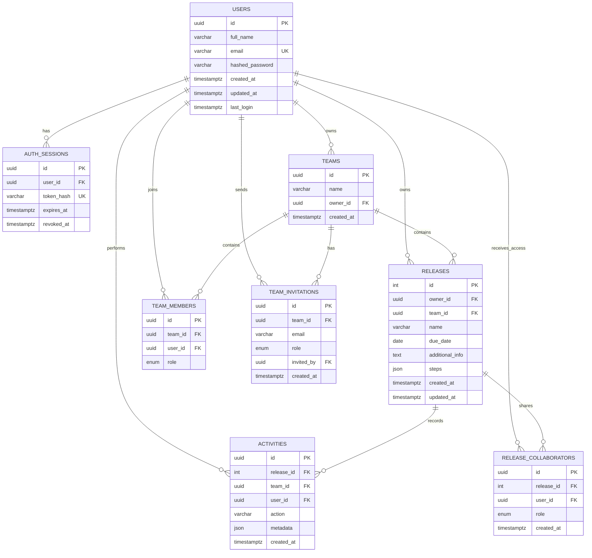

# ReleaseFlow

ReleaseFlow is a collaborative release-management SaaS application. Individuals and role-controlled teams can plan releases, customize ordered checklists, update notes, and see changes and audit history in real time.

## Live Demo

**[Open ReleaseFlow](https://releaseflow-web-bhavukm007.onrender.com/)**

> The application uses Render's free tier, so the first visit after inactivity
> may briefly display “Starting server...” while the API wakes automatically.

## Project links

- Live demo: [https://releaseflow-web-bhavukm007.onrender.com/](https://releaseflow-web-bhavukm007.onrender.com/)
- API: `https://releaseflow-api-bhavukm007.onrender.com`
- Interactive API docs: `https://releaseflow-api-bhavukm007.onrender.com/docs`

If a Render service is renamed, update these links and the corresponding environment variables.

## Features

- Email/password signup and login with bcrypt, short-lived JWT access tokens, rotating refresh tokens, secure HTTP-only cookies, logout, and session revocation
- Private releases plus collaborative team workspaces
- Release-scoped owner, admin, and other permissions enforced by the API
- Existing-user and pending-email team invitations with automatic membership on signup
- Dynamic ordered JSON checklists: add, rename, delete, reorder, check, and uncheck steps
- Automatically computed `planned`, `ongoing`, and `done` statuses
- Activity timelines and WebSocket-driven synchronization
- Search, due-date sorting, pagination-ready API, optimistic checklist updates, caching, route-level code splitting, skeletons, toasts, and dark mode
- Responsive React UI, PostgreSQL persistence, Alembic migrations, Docker, Render Blueprint, and automated tests

## Architecture

```text
React + TypeScript SPA
  |-- Axios REST requests (Bearer access token)
  |-- HTTP-only refresh cookie
  `-- authenticated WebSocket
             |
FastAPI API
  |-- Pydantic request/response validation
  |-- authorization dependencies and service layer
  |-- SQLAlchemy 2.0 connection pool
  `-- activity and realtime services
             |
PostgreSQL + Alembic
```

The access token is kept only in browser memory. The longer-lived refresh token is stored in a secure, HTTP-only cookie, hashed in the database, rotated on refresh, and revoked on logout. Release access is explicit: belonging to a team does **not** reveal every team release. A user sees a release only when they own it or appear in its `release_collaborators` list.

## Database schema



Checklist items remain embedded in each release's ordered JSON object; there is no steps table. A release is personal when `team_id` is null and collaborative when `team_id` references a team.

### Release permission matrix

| Action | Owner | Admin | Other |
|---|:---:|:---:|:---:|
| View release | ✅ | ✅ | ✅ |
| Edit name, due date, and notes | ✅ | ✅ | ❌ |
| Check/uncheck checklist items | ✅ | ✅ | ✅ |
| Add, rename, reorder, or delete checklist items | ✅ | ✅ | ✅ |
| Add/remove teammates and change roles | ✅ | ✅ | ❌ |
| Delete release | ✅ | ❌ | ❌ |

Team owners and admins can still manage team membership. Release owners and
release admins manage access to an individual release. A team member receives
no release access until explicitly added.

## API

All routes except signup, login, refresh, health, and the OpenAPI pages require `Authorization: Bearer <access-token>`.

| Method | Endpoint | Purpose |
|---|---|---|
| `POST` | `/auth/signup` | Create an account and accept matching pending invitations |
| `POST` | `/auth/login` | Authenticate and issue tokens |
| `POST` | `/auth/refresh` | Rotate a refresh token and issue a new access token |
| `POST` | `/auth/logout` | Revoke the refresh session and clear its cookie |
| `GET` | `/auth/me` | Return the authenticated user |
| `GET` | `/releases?team_id=&offset=&limit=` | List accessible personal or team releases |
| `GET` | `/releases/{id}` | Read an accessible release |
| `POST` | `/releases` | Create a personal or team release |
| `PUT` | `/releases/{id}` | Update release fields |
| `PATCH` | `/releases/{id}/steps` | Legacy fixed-checklist-compatible update |
| `PATCH` | `/releases/{id}/checklist` | Replace the ordered dynamic checklist |
| `PATCH` | `/releases/{id}/info` | Update release notes |
| `GET` | `/releases/{id}/activities` | Read the newest activity first |
| `POST` | `/releases/{id}/collaborators` | Add a registered teammate to one release |
| `PATCH` | `/releases/{id}/collaborators/{user_id}` | Change a release role |
| `DELETE` | `/releases/{id}/collaborators/{user_id}` | Remove release access |
| `GET` | `/activities?limit=` | Read recent accessible workspace activity |
| `DELETE` | `/releases/{id}` | Delete an authorized release |
| `GET` | `/teams` | List teams and membership details |
| `POST` | `/teams` | Create a team |
| `GET` | `/teams/{id}` | Read a team |
| `POST` | `/teams/{id}/invitations` | Invite or immediately add a user |
| `DELETE` | `/teams/{id}/members/{user_id}` | Remove a member |
| `POST` | `/teams/{id}/transfer` | Transfer ownership |
| `DELETE` | `/teams/{id}` | Delete a team |
| `WS` | `/ws?token=<access-token>` | Receive authorized workspace invalidation events |
| `GET` | `/health` | Health check |

FastAPI exposes the complete generated contract at `/docs` and `/openapi.json`.

## Status computation

- `planned`: no checklist items are completed
- `ongoing`: at least one but not all items are completed
- `done`: all items are completed

Status and progress counts are computed from checklist JSON and are never stored.

## Repository layout

```text
ReleaseFlow/
|-- backend/
|   |-- alembic/versions/       # Additive schema migrations
|   |-- app/api/                # Auth, releases, teams, realtime
|   |-- app/core/               # Settings and token/password security
|   |-- app/database/           # Engine and session dependency
|   |-- app/models/             # SQLAlchemy models
|   |-- app/schemas/            # Pydantic contracts
|   |-- app/services/           # Business rules, permissions, activity
|   |-- tests/
|   |-- Dockerfile
|   `-- seed.py
|-- frontend/
|   |-- src/api/                # Typed Axios clients
|   |-- src/components/
|   |-- src/contexts/
|   |-- src/hooks/
|   |-- src/pages/
|   |-- Dockerfile
|   `-- nginx.conf
|-- docker-compose.yml
`-- render.yaml
```

## Local development

Requirements: Python 3.12+, Node.js 20.19+ or 22.12+, PostgreSQL 15+.

### Backend

```bash
cd backend
python -m venv .venv
# PowerShell: .\.venv\Scripts\Activate.ps1
# macOS/Linux: source .venv/bin/activate
pip install -r requirements.txt
cp .env.example .env
alembic upgrade head
python seed.py
uvicorn app.main:app --reload
```

On PowerShell, use `Copy-Item .env.example .env` instead of `cp` if needed. The seed creates three releases and prints the local demo credentials.

### Frontend

```bash
cd frontend
npm ci
cp .env.example .env
npm run dev
```

Open `http://localhost:5173`.

### Tests and build

```bash
cd backend
pytest

cd ../frontend
npm test -- --run
npm run build
```

## Environment variables

### Backend

| Variable | Required in production | Description |
|---|---:|---|
| `DATABASE_URL` | Yes | PostgreSQL SQLAlchemy URL; Render's standard URL is normalized automatically |
| `CORS_ORIGINS` | Yes | Comma-separated exact frontend origins, with no wildcard |
| `JWT_SECRET` | Yes | Long random signing secret; generated by the Blueprint |
| `ACCESS_TOKEN_MINUTES` | No | Access-token lifetime; default `15` |
| `REFRESH_TOKEN_DAYS` | No | Refresh-token lifetime; default `7` |
| `COOKIE_SECURE` | Yes | Set `true` for HTTPS deployments |
| `RATE_LIMIT_PER_MINUTE` | No | Per-process IP request limit; default `120` |
| `DATABASE_POOL_SIZE` | No | Persistent database connections; default `5` |
| `DATABASE_MAX_OVERFLOW` | No | Temporary overflow connections; default `10` |
| `DATABASE_POOL_RECYCLE_SECONDS` | No | Recycle interval; default `1800` |
| `PORT` | Render-managed | Uvicorn port |

### Frontend

| Variable | Required | Description |
|---|---:|---|
| `VITE_API_URL` | Yes | Public API origin, without a trailing slash |
| `VITE_API_TIMEOUT_MS` | No | Per-request timeout; defaults to `25000` ms |

Never commit `.env`, production database credentials, or JWT secrets.

## Docker

```bash
docker compose config
docker compose up --build
```

The stack starts PostgreSQL, waits for database health, applies all migrations, then starts the API and Nginx-served SPA.

- UI: `http://localhost:8080`
- API: `http://localhost:8000`
- Docs: `http://localhost:8000/docs`

Stop with `docker compose down`. The `postgres_data` volume preserves data.

## Render deployment

The root [render.yaml](render.yaml) declares managed PostgreSQL, a Docker FastAPI service, and a React static site. It wires the database connection, generates `JWT_SECRET`, enables secure refresh cookies, restricts CORS to the UI origin, configures the API URL at frontend build time, runs Alembic from the backend container, and rewrites SPA routes to `index.html`.

Exact steps after pushing to GitHub:

1. Open [Render Dashboard](https://dashboard.render.com/) and connect the GitHub account that owns this repository.
2. Choose **New + → Blueprint**.
3. Select `bhavukm007/ReleaseFlow`.
4. Confirm the Blueprint path is `render.yaml`, then choose **Apply**.
5. Wait for `releaseflow-db-bhavukm007`, `releaseflow-api-bhavukm007`, and `releaseflow-web-bhavukm007` to deploy.
6. Confirm `https://releaseflow-api-bhavukm007.onrender.com/health` returns `{"status":"healthy"}`.
7. Open `/docs`, create an account in the web UI, create a release, edit a checklist and notes, create a team, and verify the changes survive refresh.
8. Open two browsers with two invited accounts and verify a team checklist update appears in the other browser.
9. If Render assigns different service names, set backend `CORS_ORIGINS` to the exact UI origin and frontend `VITE_API_URL` to the exact API origin, then redeploy both.
10. Submit the live application link and API docs link from **Project links**.

Free Render services may cold-start, and free database retention policies can change. Check the current Render plan before relying on it for a long-lived production deployment.

### Free-tier cold starts

Render Free web services spin down after 15 minutes without inbound HTTP or
WebSocket traffic and can take about one minute to wake. ReleaseFlow handles
this automatically:

1. The authentication bootstrap first wakes `/health`, avoiding repeated
   refresh-token rotation during a cold start.
2. Network errors, timeouts, temporary Render HTML responses, HTTP 408/425/429,
   and HTTP 5xx responses are retried.
3. Retries use exponential delays of 1, 2, 4, 8, 16, and 30 seconds.
4. The UI displays skeletons and **Starting server...** while retrying.
5. A terminal error is shown only after all seven attempts fail.

The backend logs `startup_phase` records for migrations, Uvicorn execution, and
application readiness. These timings are visible in Render Logs and make cold
start regressions measurable.

## Screenshots

Add current deployment screenshots here after the public Render URLs are live. Recommended captures: login, My Releases, dynamic checklist with activity timeline, and team management.

## Security and scalability notes

- Passwords are bcrypt-hashed and are never returned.
- Refresh tokens are hashed at rest, rotated, revocable, HTTP-only, SameSite-protected, and Secure in production.
- Resource lookup returns `404` for inaccessible releases to reduce identifier disclosure.
- Authorization is enforced server-side for every release and team mutation.
- CORS uses an explicit environment-controlled allowlist; GZip and request throttling are enabled.
- Database foreign keys and indexes support common ownership, team, activity, email, and due-date queries.
- The included rate limiter and WebSocket registry are process-local. For horizontal multi-instance deployment, use Redis-backed distributed rate limiting and pub/sub.

## Future improvements

- Verified password-reset emails and email ownership verification
- Redis-backed WebSocket fan-out, distributed rate limits, and job queues
- Checklist templates, notification preferences, and external email delivery
- Cursor pagination for very large workspaces
- Object-level observability, tracing, metrics, and automated browser performance budgets
